

  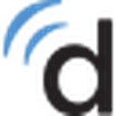

# Scribe Message Watcher

A Chrome extension that streamlines the Doximity Scribe AI medical dictation workflow — replacing the mobile device with your desktop browser and microphone so you never leave the patient encounter.

## The Problem

AI-powered medical scribes like Doximity Scribe and Nuance DAX are transforming clinical documentation, but the current workflow has real friction points that pull providers out of the patient encounter:

- **Mobile device dependency** — Recording through a phone means worrying about battery life, keeping the app foregrounded, and having a personal device actively listening during the visit. Patients notice.
- **Waiting for results** — After stopping a recording, the provider has to switch back to the phone or check a separate tab to see if the note is ready. There's no push notification to the workstation where charting happens.
- **Manual copy/paste into the EHR** — Once the scribe result is generated, getting that text into the actual clinical note requires navigating to the result, selecting the text, copying it, switching to the EHR, and pasting it. Every extra click adds up across a full day of visits.

These interruptions break the flow of the encounter. The provider ends up juggling a phone, a browser, and an EHR — all while trying to be present with the patient.

## The Solution

Scribe Message Watcher moves the entire Doximity Scribe workflow into the Chrome browser, where you're already working. A desktop or external USB/Bluetooth microphone (such as the [Anker PowerConf](https://www.anker.com/products/a3301-anker-powerconf-bluetooth-speakerphone) or [AnkerWork S600](https://www.ankerwork.com/products/a3307-ankerwork-s600-speakerphone)) replaces the mobile device, and the extension handles the rest:

1. **Start recording from the browser** — Click the extension icon or press `Alt+M`. No phone needed. The desktop mic picks up the conversation with better audio quality than a phone across the room.
2. **Control recording without switching tabs** — Keyboard shortcuts (`Alt+M` to pause/resume, `Alt+G` to generate, `Alt+C` to cancel) work globally, so you stay in your EHR while Scribe records in the background.
3. **Get notified when the note is ready** — Chrome sends a desktop notification the moment Scribe finishes generating. No more checking back.
4. **One-click copy** — Open the extension popup, see your recent notes, and click copy. The scribe result is on your clipboard, ready to paste into the EHR.
5. **Optional EHR auto-fill** — With PracticeQ/IntakeQ integration enabled, the extension reads the currently-open patient's name, DOB, MRN, and visit date, then fills those fields into the copied note automatically. No retyping demographics.

The result: **the entire dictation-to-note workflow happens in the browser, in front of the patient, without breaking the flow of the visit.**

  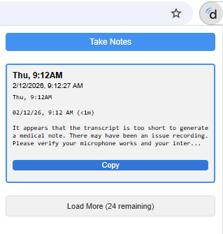
  &nbsp;&nbsp;&nbsp;
  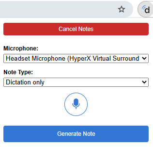

## Features

- **Browser-based recording** — Use any desktop, USB, or Bluetooth microphone instead of a mobile device
- **Global keyboard shortcuts** — Control recording from any tab without switching context
- **Desktop notifications** — Chrome notifies you the moment a new dictation is ready
- **One-click copy** — View recent notes in the popup and copy results instantly
- **Recording status badge** — Extension icon shows recording state at a glance
- **PracticeQ/IntakeQ integration** — Optionally pull patient demographics into the copied note
- **DotExpander integration** — Optionally send dictations to DotExpander as the `@scribe@` snippet variable
- **Debug mode** — Toggle detailed logging from the options page for troubleshooting

## Installation

### 1. Download the extension

- Go to the [GitHub repository](https://github.com/jmdurant/scribe-message-watcher)
- Click the green **Code** button, then **Download ZIP**
- Extract the ZIP file to a folder on your computer (e.g. `C:\Extensions\scribe-message-watcher`)

### 2. Load in Chrome

- Open Chrome and navigate to `chrome://extensions/`
- Enable **Developer mode** using the toggle in the top right corner
- Click **Load unpacked**
- Select the extracted extension folder

### 3. Pin the extension

Click the puzzle piece icon in the Chrome toolbar, then click the pin icon next to **Scribe Message Watcher** so it's always visible.

  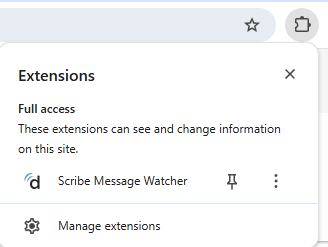

### 4. Log in to Doximity

Click the extension icon. If you're not logged in, you'll see the screen below — click **Open Doximity Scribe** to open the login page, then log in.

  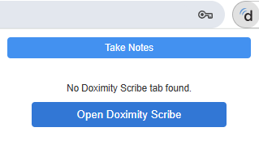

The extension will automatically detect the Doximity tab and pin it.

## Keyboard Shortcuts

| Shortcut | Action |
|----------|--------|
| `Alt+M` | Toggle microphone (Start / Pause / Resume) |
| `Alt+G` | Generate note |
| `Alt+C` | Cancel / discard recording |
| `Alt+,` | Open extension popup |

Shortcuts work globally — you don't need to be on the Doximity tab.

To customize shortcuts, go to `chrome://extensions/shortcuts` in your browser.

## Usage

### Recording a Visit

1. Open the extension popup (`Alt+,` or click the icon)
2. Click **Take Notes** — the extension navigates to Doximity Scribe's recording page
3. Select your microphone and note type from the dropdowns
4. Press `Alt+M` or click the mic button to start recording
5. Conduct the visit normally — the desktop mic captures the conversation
6. Press `Alt+M` to pause if needed, then `Alt+M` again to resume
7. Press `Alt+G` to generate the note when the visit is complete

### Getting the Result

- Chrome sends a **desktop notification** when the note is ready — click **Copy Content** to copy directly from the notification, or **Open Scribed Note** to view it
- Notifications are suppressed when the Doximity Scribe tab is the active tab (similar to how Gmail skips notifications when the inbox is already on screen)
- Click the extension icon to see your recent notes
- Click **Copy** on any note to copy it to your clipboard
- Paste into your EHR

  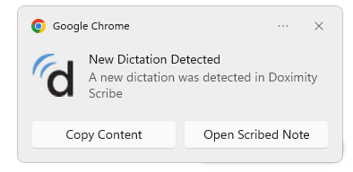

### With PracticeQ Integration

When enabled in options, the extension reads the patient currently open in PracticeQ/IntakeQ and automatically fills in `[Name]`, `[DOB]`, `[MRN]`, `[Date]`, and `[Referring Provider Name]` placeholders in the copied note.

### Canceling a Recording

- Click **Cancel Notes** in the popup, or press `Alt+C`

## Extension Icon Status

The extension icon shows the current state at a glance:

| Icon | Status |
|------|--------|
| 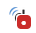 | Recording in progress |
| 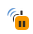 | Recording paused |
| 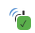 | Note generated |
|  | New dictation available |

## EHR Integration Details

### How It Works

The PracticeQ/IntakeQ integration uses a dedicated content script (`intakeq_content.js`) that runs on IntakeQ pages. The data flow is entirely client-side with no PHI persisted:

1. **Content script scrapes the EHR page** — When you have a patient open in IntakeQ (`intakeq.com/#/client/*`), the content script extracts demographics from the DOM: patient name, DOB, MRN, visit date, start/end times, provider, and referring provider.
2. **Popup requests data at render time** — When the extension popup renders your note list with PracticeQ integration enabled, it sends a `GET_CLIENT_DATA` message to the IntakeQ tab.
3. **Visit matching** — The extension compares each note's timestamp against the current visit's start/end time window to identify which dictation belongs to the open appointment.
4. **Template fill at display time** — Matching notes have placeholders replaced with patient data before rendering:
   - `[Name]` — Patient name
   - `[DOB]` — Date of birth
   - `[MRN]` — Client ID / Medical Record Number
   - `[Date]` — Visit date
   - `[Referring Provider Name]` — Referring provider
   - `[Consulting Provider Name]` — Treating provider
5. **Copy includes filled data** — When you copy a note, the clipboard gets the template-filled version with patient demographics already inserted.

The original note body in the cache is never modified — the merge happens in-memory at display/copy time only. No EHR data is stored by the extension.

### Supported EHR Systems

| System | Status | Content Script |
|--------|--------|----------------|
| PracticeQ / IntakeQ | Supported | `intakeq_content.js` |
| OpenEMR | Planned | — |

### DotExpander Integration

The [DotExpander](https://dotexpander.com) integration provides two ways to get dictation text into your text expansion workflow. Both use Chrome's cross-extension messaging API — no server involved.

**Automatic variable push** — When a new dictation is detected, the background service worker automatically sends the note content to DotExpander as a snippet variable. This makes `@scribe@` immediately available for use in any DotExpander snippet or template. The variable includes both the dictation text and a timestamp.

**Manual snippet saving** — Each note in the popup has a "Save Snippet" button. Clicking it opens a dialog where you can:
1. Name the snippet (defaults to a timestamped name like `Dictation_2026-02-10_3-45PM`)
2. Select an existing DotExpander folder or create a new one
3. Save the full note body as a reusable text expansion snippet

Both features communicate directly with the DotExpander extension via Chrome's cross-extension messaging API. The extension automatically detects DotExpander when you enable the integration in options — no manual configuration needed.

## Privacy & Data Handling

This extension processes clinical dictation content. All patient health information (PHI) is stored in **session-only memory** using `chrome.storage.session` — nothing is written to disk.

| Data | Storage | Persistence |
|------|---------|-------------|
| Note bodies (dictation text) | Session (memory) | Cleared when browser closes |
| Cached notes list | Session (memory) | Cleared when browser closes |
| Visit identifiers | Session (memory) | Cleared when browser closes |
| Microphone preference | Local (disk) | Persists across restarts |
| Note type preference | Local (disk) | Persists across restarts |
| Extension settings | Chrome Sync | Syncs across devices |

No PHI is transmitted to any server other than Doximity. The extension communicates only with the Doximity Scribe tab already open in your browser.

## Options

Right-click the extension icon and select **Options** to configure:

- **PracticeQ Integration** — Enable/disable EHR patient data auto-fill
- **DotExpander Integration** — Enable/disable sending dictations to DotExpander (auto-detects the extension)
- **Debug Mode** — Enable detailed console logging for troubleshooting

## Recommended Microphones

Any desktop or USB microphone works, but conference speakerphones designed for room pickup work especially well in an exam room:

- **Anker PowerConf** — Bluetooth/USB speakerphone with 360-degree pickup
- **AnkerWork S600** — USB-C speakerphone with enhanced voice clarity and wireless charging pad

  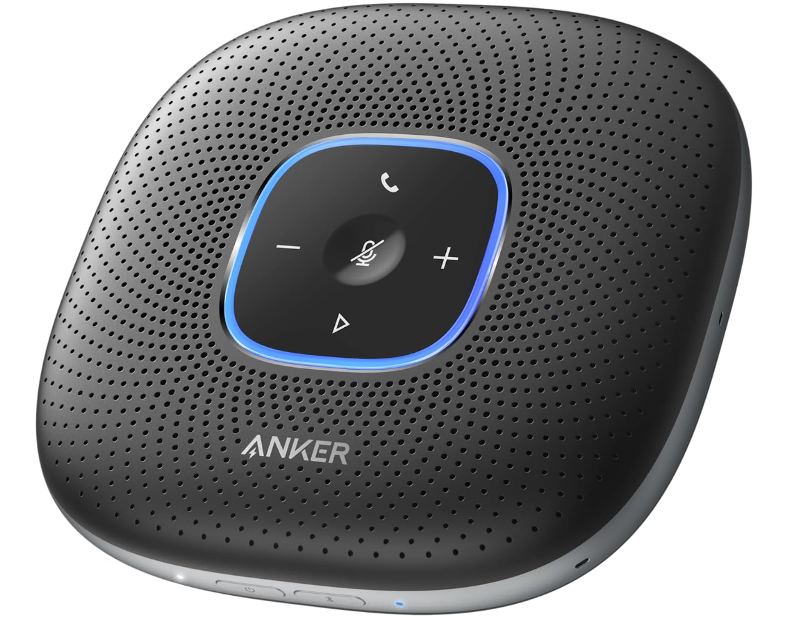
  &nbsp;&nbsp;&nbsp;&nbsp;
  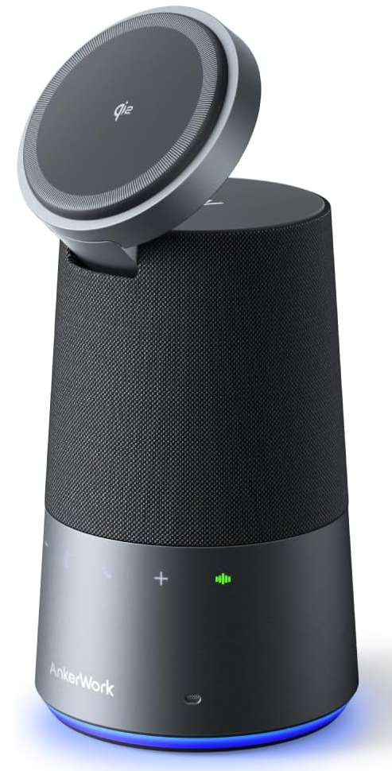

These sit on the desk, pick up both provider and patient clearly, and don't require a phone in the room.

## Files

| File | Purpose |
|------|---------|
| `manifest.json` | Extension configuration (permissions, content scripts, shortcuts) |
| `shared.js` | Shared utilities (debug logging, tab finding, badge updates) |
| `background.js` | Service worker for notifications, polling, and keyboard shortcuts |
| `content.js` | Content script for Doximity Scribe page interaction |
| `intakeq_content.js` | Content script for PracticeQ/IntakeQ patient data extraction |
| `popup.html` | Extension popup markup |
| `popup.js` | Popup initialization, state management, and event listeners |
| `popup-ui.js` | Popup rendering functions (notes list, mic controls, dialogs) |
| `popup-notes.js` | Note fetching, caching, and template logic |
| `popup-controls.js` | Microphone and recording control functions |
| `offscreen.html` / `offscreen.js` | Offscreen document for clipboard access from notifications |
| `options.html` / `options.js` | Extension settings page |

## Author

James M DuRant III MD MBA
Developmental-Behavioral Pediatrician
[Doximity Profile](https://www.doximity.com/pub/james-durant-md-06d4dc27) | [james@doctordurant.com](mailto:james@doctordurant.com) | [developmentalondemand.com](https://developmentalondemand.com)

## License

Integrates with Doximity Scribe.
